## Data Mesh Platform Setup

<p class="warn">
    ⛷️ <b>NOTE</b> ⛷️ - You need an OpenShift 4.11+ cluster (the instructions target v4.13) with cluster-admin privilege to run the <strong>Data Mesh Platform</strong>. At a minimum, you need an AWS account and a RedHat developer account to create a Single Node OpenShift instance. If you are a RedHat associate or partner - login to RedHat's RHPDS system and order the "AWS Blank Open Environment" sandbox. If you already have admin access to an OpenShift 4.11+ cluster - you can skip the cluster install steps.
</p>

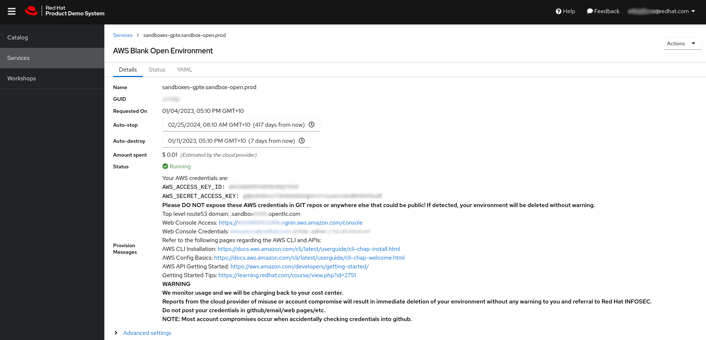

### SNO for 100

My favourite development environment has become SNO on SPOT in AWS. With this setup, if you choose your region and zones wisely, you can have an environment running all day without interruption. All you need is an AWS account. You can of course run the platform on any 4.11+ OpenShift cluster, it does not have to be SNO !

1. For me that is *Ohio* ! To get a 16 core, 64 GB machine for less than $4 a day i use the following [script and config to install the cluster.](https://github.com/eformat/sno-for-100)

   ```bash
   export AWS_PROFILE=rhpds
   export AWS_DEFAULT_REGION=us-east-2
   export AWS_DEFAULT_ZONES=["us-east-2c"]
   export CLUSTER_NAME=foo
   export BASE_DOMAIN=sandbox1234.opentlc.com
   export PULL_SECRET=$(cat ~/tmp/pull-secret)
   export SSH_KEY=$(cat ~/.ssh/id_rsa.pub)
   export INSTANCE_TYPE=m6a.4xlarge
   export ROOT_VOLUME_SIZE=200
   export OPENSHIFT_VERSION=4.11.25
   
   mkdir -p ~/tmp/sno-foo && cd ~/tmp/sno-foo
   curl -Ls https://raw.githubusercontent.com/eformat/sno-for-100/main/sno-for-100.sh | bash -s -- -d
   ```
   
   This will take some time to complete. The script is re-runnable if it fails unexpectedly. It should look like this when you start it.
   
   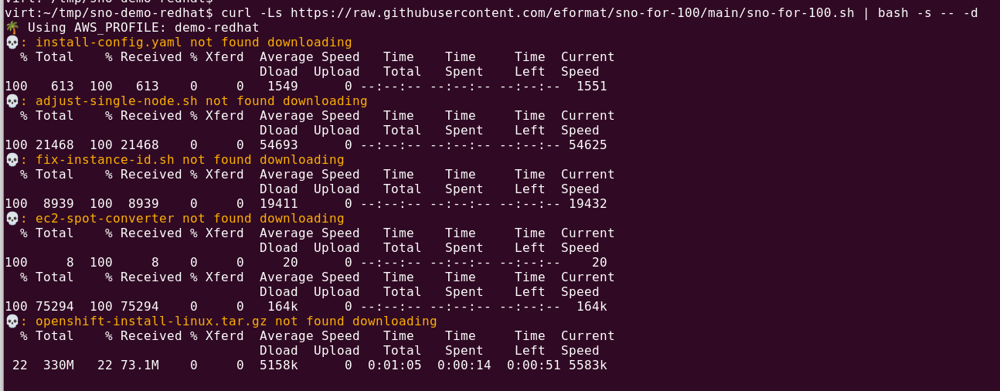
   
2.   Once done, you should have a login to your OpenShift Cluster printed in the console output. There are some infra-ops steps we need to do from the command line, so login now as _kubeadmin_ to your cluster.
   
   ```bash
   export CLUSTER_DOMAIN=<CLUSTER_DOMAIN>
   ```
   
   ```bash
   oc login --server=https://api.${CLUSTER_DOMAIN##apps.}:6443 -u kubeadmin -p <PASSWORD>
   ```
   
   <p class="tip">
     ⛷️ <b>TIP</b> ⛷️ - You can easily set up a local cronjob from your laptop to run <strong>aws ec2 start-instances</strong> for your spot instance id. If the instance is killed temporarily during peak load in your aws region and zone, this will start it once capacity is available again. You can also convert the instance from SPOT back to ON-DEMAND if you wish using the <strong>ec2-spot-converter</strong> script.
   </p>

### Add HTPassword

1. My goto IDP for the admin user is **htpassword** rather than the default _kubeadmin_ user. We will also configure IPA in-cluster for our data science users as we need ldap capabilities for some of our tools. You can choose a suitable **ADMIN PASSWORD**.

   ```bash
   export ADMIN_PASSWORD=<ADMIN PASSWORD>
   htpasswd -bBc /tmp/htpasswd admin ${ADMIN_PASSWORD}
   ```

2. Add the admin user as a cluster-admin and create the htpasswd as a secret.

   ```bash
   oc adm policy add-cluster-role-to-user cluster-admin admin
   oc delete secret htpasswdidp-secret -n openshift-config
   oc create secret generic htpasswdidp-secret -n openshift-config --from-file=/tmp/htpasswd
   ```

3. Configure the cluster OAuth provider to use htpasswd.

   ```bash
   cat << EOF > /tmp/htpasswd.yaml
   apiVersion: config.openshift.io/v1
   kind: OAuth
   metadata:
     name: cluster
   spec:
     identityProviders:
     - name: htpasswd_provider
       type: HTPasswd
       htpasswd:
         fileData:
           name: htpasswdidp-secret
   EOF
   oc apply -f /tmp/htpasswd.yaml -n openshift-config
   ```

4. Watch the authentication cluster operator for the OAuthServerDeployment to become Available.

   ```bash
   watch oc get co/authentication
   ```
   
   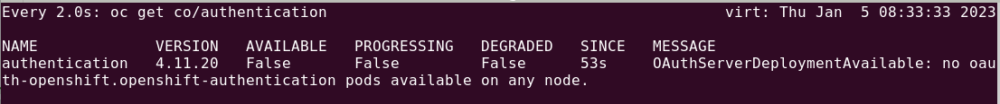
   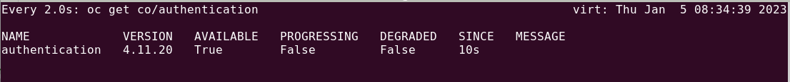

5. Now login as the admin user.

   ```bash
   oc login --server=https://api.${CLUSTER_DOMAIN##apps.}:6443 -u admin -p ${ADMIN_PASSWORD}
   ```

6. And delete the installation temporary kubeadmin account secret.

   ```bash
   oc delete secret kubeadmin -n kube-system
   ```

### Configure Lets Encrypt

I use acme.sh all the time for generating Lets Encrypt certs, its easy and fast. The only downside is its also a bit of manual labour.

1. Create _caa.your-domain_ entries in your two Route53 hosted zones.   

   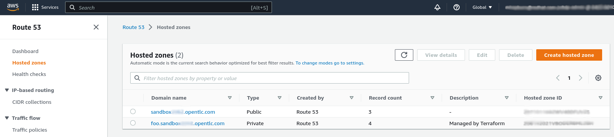
   
   Enter this as the **Record name**
   
   ```bash
   caa
   ```
   
   Enter this as the **Value**
   
   ```bash
   0 issuewild "letsencrypt.org;"
   ```
   
   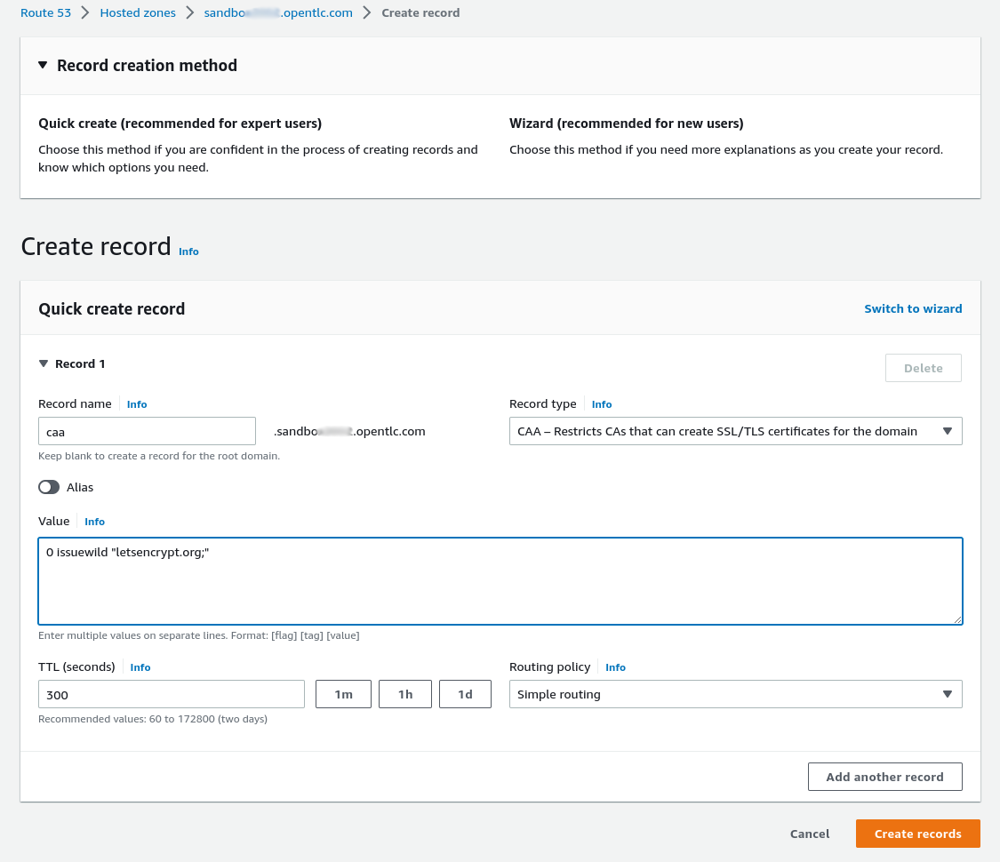

2. On the command line, export your AWS credentials.

   ```bash
   export AWS_ACCESS_KEY_ID=<aws key id>
   export AWS_SECRET_ACCESS_KEY=<aws secret access key>
   ```

3. Grab the cluster api and wildcard domain and export them as environment variables. We will create a Let's Encrypt cert with Subject Alternate names for these domains. 

   ```bash
   export LE_API=$(oc whoami --show-server | cut -f 2 -d ':' | cut -f 3 -d '/' | sed 's/-api././')
   export LE_WILDCARD=$(oc get ingresscontroller default -n openshift-ingress-operator -o jsonpath='{.status.domain}')
   ```

4. Clone the fabulous **acme.sh** git repo to your local machine.

   ```bash
   cd ~/git
   git clone https://github.com/Neilpang/acme.sh.git
   ```

5. Now run the acme shell script to create your certificate requests.

   ```bash
   ~/git/acme.sh/acme.sh --issue --dns dns_aws -d ${LE_API} -d *.${LE_WILDCARD} --dnssleep 100 --force --insecure
   ```

6. Once complete, your certificates will be downloaded and available in your home directory.

   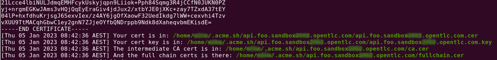

7. We can now configure the default OpenShift ingress router to use them.

   ```bash
   oc -n openshift-ingress delete secret router-certs
   oc -n openshift-ingress create secret tls router-certs --cert=/home/$USER/.acme.sh/${LE_API}/fullchain.cer --key=/home/$USER/.acme.sh/${LE_API}/${LE_API}.key
   oc -n openshift-ingress-operator patch ingresscontroller default --patch '{"spec": { "defaultCertificate": { "name": "router-certs"}}}' --type=merge
   ```

8. Watch the cluster operators and wait till they are all showing available.

   ```bash
   watch oc get co
   ```

9. (Optional) If you think you will need more than the 250 pods per node, apply the large pods `kubeletconfig` - this will reboot the SNO cluster.

   ```bash
   oc apply -f platform/kubelet-config.yaml
   ```

### Configure Extra Disk

To keep things cheap, I use a 200GB gp3 volume and configure the OpenShift LVM Operator to use it as the default dynamic Storage Class for my SNO instance.

1. Get your aws instance id.

   ```bash
   export INSTANCE_ID=$(aws ec2 describe-instances \
   --query "Reservations[].Instances[].InstanceId" \
   --filters "Name=tag-value,Values=$CLUSTER_NAME-*-master-0" "Name=instance-state-name,Values=running" \
   --output text)
   ```

2. Get the aws zone for your instance id.

   ```bash
   export AWS_ZONE=$(aws ec2 describe-instances \
   --query "Reservations[].Instances[].Placement.AvailabilityZone" \
   --filters "Name=tag-value,Values=$CLUSTER_NAME-*-master-0" "Name=instance-state-name,Values=running" \
   --output text)
   ```

3. Create the volume.

   ```bash
   vol=$(aws ec2 create-volume \
   --availability-zone ${AWS_ZONE} \
   --volume-type gp3 \
   --size 200 \
   --region=${AWS_DEFAULT_REGION})
   ```

4. Attach the volume to your instance.

   ```bash
   aws ec2 attach-volume \
   --volume-id $(echo ${vol} | jq -r '.VolumeId') \
   --instance-id ${INSTANCE_ID} \
   --device /dev/sdf
   ```

5. You should see the successful attachment output printed. 

   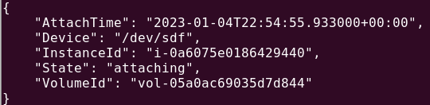

6. Next we are going to configure the LVM Operator to use this disk. Create a namespace.

   ```bash
   cat <<EOF | oc apply -f-
   kind: Namespace
   apiVersion: v1
   metadata:
     name: openshift-storage
   EOF
   ```

7. Create an operator group.

   ```bash
   cat <<'EOF' | oc apply -f-
   apiVersion: operators.coreos.com/v1
   kind: OperatorGroup
   metadata:
     name: operator-storage
     namespace: openshift-storage
   spec:
     targetNamespaces:
     - openshift-storage
   EOF
   ```

8. Create the operator subscription.

   OpenShift v4.11
   ```bash
   cat <<EOF | oc apply -f-
   apiVersion: operators.coreos.com/v1alpha1
   kind: Subscription
   metadata:
     labels:
       operators.coreos.com/odf-lvm-operator.openshift-storage: ''
     name: odf-lvm-operator
     namespace: openshift-storage
   spec:
     channel: stable-4.11
     installPlanApproval: Automatic
     name: odf-lvm-operator
     source: redhat-operators
     sourceNamespace: openshift-marketplace
   EOF
   ```

   OpenShift v4.12+ e.g. set channel - stable-4.12, stable-4.13
   ```bash
   CHANNEL=stable-4.13
   cat <<EOF | oc apply -f-
   apiVersion: operators.coreos.com/v1alpha1
   kind: Subscription
   metadata:
     labels:
       operators.coreos.com/odf-lvm-operator.openshift-storage: ''
     name: lvms-operator
     namespace: openshift-storage
   spec:
     channel: stable-4.13
     installPlanApproval: Automatic
     name: lvms-operator
     source: redhat-operators
     sourceNamespace: openshift-marketplace
   EOF
   ```

9. Wait until the operator has installed successfully.

   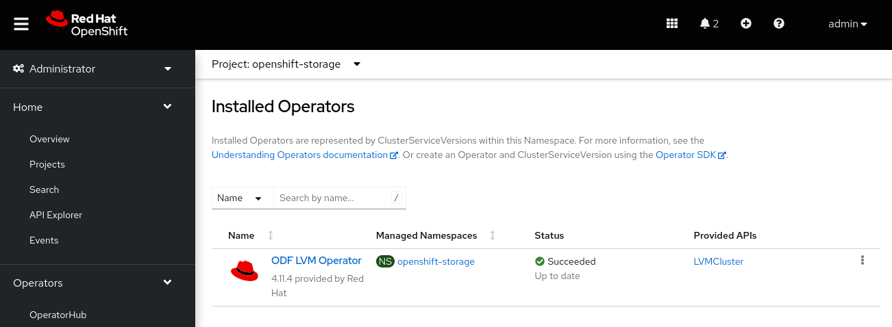

10. Configure the LVMCluster. By default this will use the gp3 disk device we configured earlier.

   ```bash
   cat <<EOF | oc apply -f-
   apiVersion: lvm.topolvm.io/v1alpha1
   kind: LVMCluster
   metadata:
     name: sno-lvm
     namespace: openshift-storage
   spec:
     storage:
       deviceClasses:
         - name: vgsno
           thinPoolConfig:
             name: thin-pool-1
             overprovisionRatio: 10
             sizePercent: 90
   EOF
   ```

11. Make the LVM storage the default storage class.

   OpenShift v4.11
   ```bash
   oc annotate sc/odf-lvm-vgsno storageclass.kubernetes.io/is-default-class=true
   ```

   OpenShift v4.12
   ```bash
   oc annotate sc/lvms-vgsno storageclass.kubernetes.io/is-default-class=true
   ```
   
   Remove old defaults (the default SC varies depending on OpenShift Cluster version)

   ```bash
   oc annotate sc/gp2 storageclass.kubernetes.io/is-default-class-
   oc annotate sc/gp3-csi storageclass.kubernetes.io/is-default-class-
   ```

   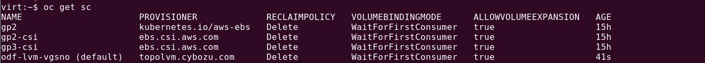

### Deploy IPA

We are going to use IPA for our data science users.

1. Deploy IPA using the helm chart.

   ```bash
   helm repo add redhat-cop https://redhat-cop.github.io/helm-charts
   helm repo up
   ```

2. Use the **ADMIN_PASSWORD** you used above and also choose a suitable **LDAP_ADMIN PASSWORD**.

   ```bash
   export LDAP_ADMIN_PASSWORD=<LDAP_ADMIN PASSWORD>
   ```

3. Now install ipa.

   ```bash
   helm upgrade --install ipa redhat-cop/ipa --namespace=ipa --create-namespace \
   --set app_domain=<CLUSTER_DOMAIN> \
   --set admin_password="${ADMIN_PASSWORD}" \
   --set ocp_auth.enabled=true \
   --set ocp_auth.bind_password="${LDAP_ADMIN_PASSWORD}" \
   --set ocp_auth.bind_dn="uid=ldap_admin\\,cn=users\\,cn=accounts\\,dc=redhatlabs\\,dc=dev" --timeout=15m
   ```

4. Wait for ipa to install, tail the logs of the ipa pod in the ipa namespace.
   
   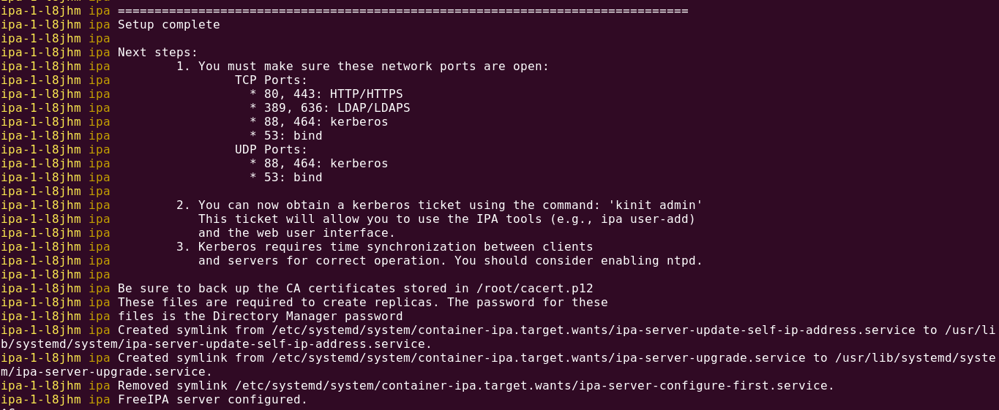

5. Then create our objects. Initialize admin.
   
   ```bash
   oc exec -it dc/ipa -n ipa -- \
   sh -c "echo ${ADMIN_PASSWORD} | /usr/bin/kinit admin"
   ```

6. Create the ldap bind user.
   
   ```bash
   oc exec -it dc/ipa -n ipa -- \
   sh -c "echo ${LDAP_ADMIN_PASSWORD} | \
   ipa user-add ldap_admin --first=ldap \
   --last=admin --email=ldap_admin@redhatlabs.dev --password"
   ```

7. Add groups to ldap bind user.
   
   ```bash
   oc exec -it dc/ipa -n ipa -- \
   sh -c "ipa group-add-member admins --users=ldap_admin"
   ```

   ```bash
   oc exec -it dc/ipa -n ipa -- \
   sh -c "ipa group-add-member editors --users=ldap_admin"
   ```
   
   ```bash
   oc exec -it dc/ipa -n ipa -- \
   sh -c "ipa group-add-member 'trust admins' --users=ldap_admin"
   ```

8. Create a group for our data science users.

   ```bash
   oc exec -it dc/ipa -n ipa -- \
   sh -c "ipa group-add student --desc 'Student Group'"
   ```

9. Create a data science user e.g. **user1**

   ```bash
   export USER_NAME=<USER NAME>
   ```

   For now, choose a password without special characters e.g. contains only "[A-Z][a-z][0-9]"
   --set gitlab.root_password=$GITLAB_ROOT_PASSWORD
   ```bash
   export USER_PASSWORD=<USER PASSWORD>
   ```

10. Create the user.

    ```bash
    oc exec -it dc/ipa -n ipa -- \
    sh -c "echo ${USER_PASSWORD} | ipa user-add ${USER_NAME} --first=${USER_NAME} \
    --last=${USER_NAME} --email=${USER_NAME}@redhatlabs.dev --password"
    ```

11. Add user to our group.

    ```bash
    oc exec -it dc/ipa -n ipa -- \
    sh -c "ipa group-add-member student --users=${USER_NAME}"
    ```

12. Lastly, configure the LDAP group sync job using a helm chart.

    ```bash
    cd ~/git
    git clone https://github.com/eformat/openshift-management
    ```

13. Install sync cronjob.

    ```bash
    helm upgrade cronjob-ldap-group-sync \
    --install charts/cronjob-ldap-group-sync \
    --set image="quay.io/openshift/origin-cli" \
    --set image_tag="latest" \
    --set ldap_bind_dn="uid=ldap_admin\\,cn=users\\,cn=accounts\\,dc=redhatlabs\\,dc=dev" \
    --set ldap_bind_password="${LDAP_ADMIN_PASSWORD}" \
    --set ldap_bind_password_secret="ldap-bind-password" \
    --set ldap_group_membership_attributes='["member"]' \
    --set ldap_group_name_attributes='["cn"]' \
    --set ldap_group_uid_attribute=ipaUniqueID \
    --set ldap_groups_filter='(&(objectclass=ipausergroup)(cn=student))' \
    --set ldap_groups_search_base="cn=groups\\,cn=accounts\\,dc=redhatlabs\\,dc=dev" \
    --set ldap_url='ldap://ipa.ipa.svc.cluster.local:389' \
    --set ldap_user_name_attributes='["uid"]' \
    --set ldap_user_uid_attribute=dn \
    --set ldap_users_search_base="cn=users\\,cn=accounts\\,dc=redhatlabs\\,dc=dev" \
    --set ldap_groups_whitelist="" \
    --set schedule="*/10 * * * *" \
    --set namespace=cluster-ops \
    --namespace=cluster-ops \
    --create-namespace
    ```

   Once the ldap group sync cronjob has run, you should see the group and user synced into the cluster.
   
   

### Install Data Mesh Platform Base using Helm

The data mesh base tooling and operators are configured using a helm chart. This configures:

- gitlab - source code repository
- devspaces - cloud ide for platform tasks
- hashicorp vault and certs - secrets managments--set gitlab.root_password=$GITLAB_ROOT_PASSWORD
- user workload monitoring - observability for user workloads
- gitops operator - argocd for teams
- pipelines operator - tekton pipelines for application builds
- rhods operator - Red Hat OpenShfift Data Science

1. Helm setup

   ```bash
   helm repo add redhat-cop https://redhat-cop.github.io/helm-charts
   helm repo add hashicorp https://helm.releases.hashicorp.com
   helm repo add eformat https://eformat.github.io/helm-charts
   helm dep up
   ```

2. We need to specify the Vault Route as a helm chart parameter as well as pass a GitLab root password.

   ```bash
   export VAULT_ROUTE=vault.<CLUSTER_DOMAIN>
   ```

   ```bash
   export GITLAB_ROOT_PASSWORD=$(openssl rand -hex 8)
   ```

3. Install the Data Mesh Platform base tooling.

   ```bash
   cd platform/base
   ```

   ```bash
   helm dep up
   ```
 
<p class="warn">
    ⛷️ <b>NOTE</b> ⛷️ - In OpenShift v4.13+ the operator for `openshift-cert-manager` changed names. You will need to update the `cluster-dev-values.yaml` and enable `openshift-cert-manager-operator-pre-413` operator config and disable `openshift-cert-manager-operator` if installing to OpenShift v4.11 and v4.12.
</p>

   ```bash
   helm upgrade --install platform-base . \
     --set vault.server.route.host=$VAULT_ROUTE \
     --set vault.server.extraEnvironmentVars.VAULT_TLS_SERVER_NAME=$VAULT_ROUTE \
     --set gitlab.root_password=$GITLAB_ROOT_PASSWORD \
     --namespace data-mesh \
     --create-namespace \
     --timeout=15m \
     --debug \
     -f cluster-dev-values.yaml
   ```

   It will take a little time to download, install and configure all the bits. Check the Status of the DevSpaces pods in the **rainforest-workspaces** project as these take the longest time to provision. 

   Once done, we are ready to start deploying more tools to our *AIMLOPS Platform as Product*.

   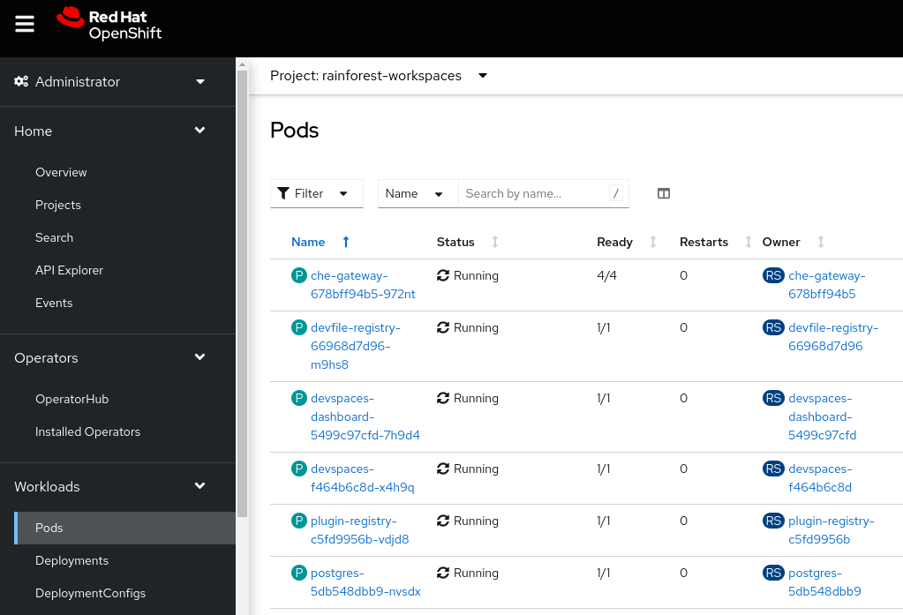

4. We need to add specific RBAC for our data science user group. We will give them namespace edit access on the `daintree-dev` project where their data science tools will live.

   ```bash
   oc adm policy add-role-to-group edit student -n daintree-dev 
   ```

🪄🪄 Now, let's continue with even more exciting tools... !🪄🪄
