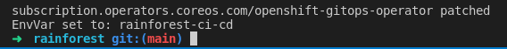
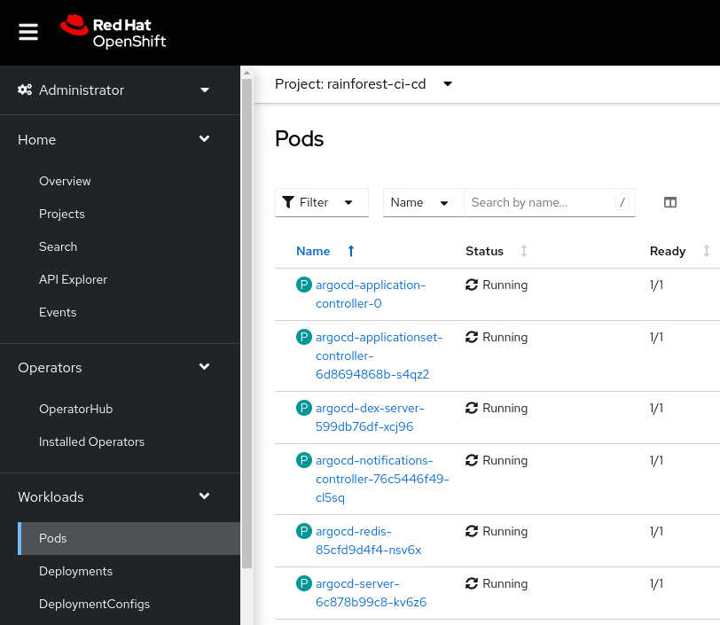
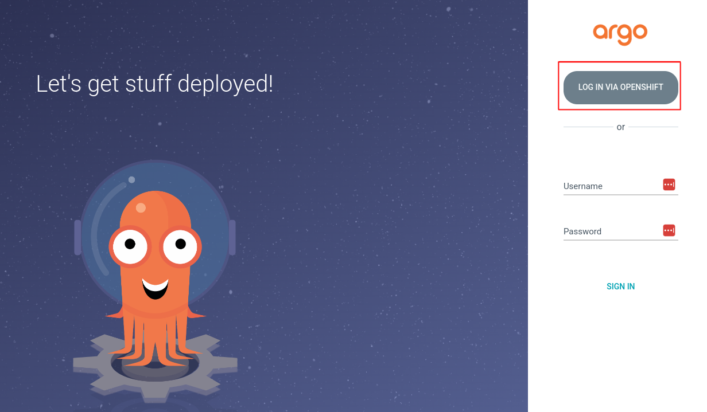
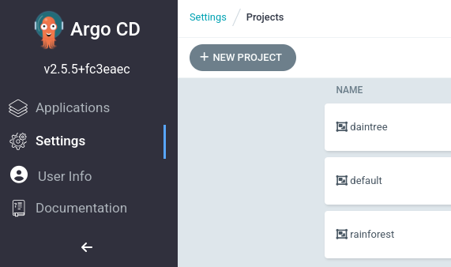
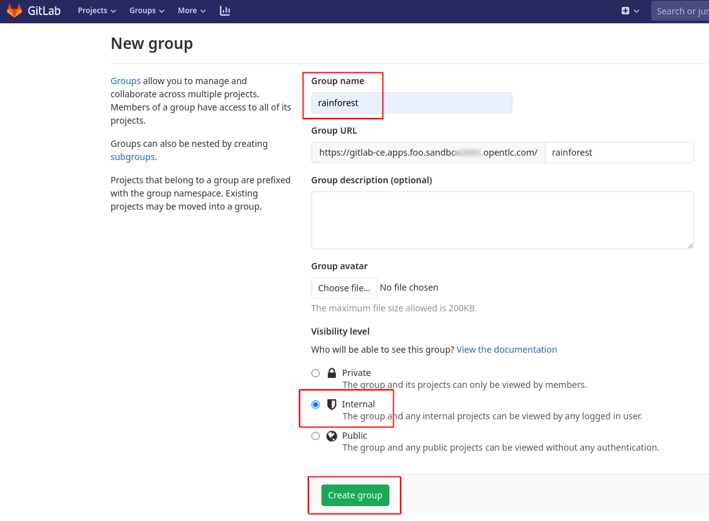
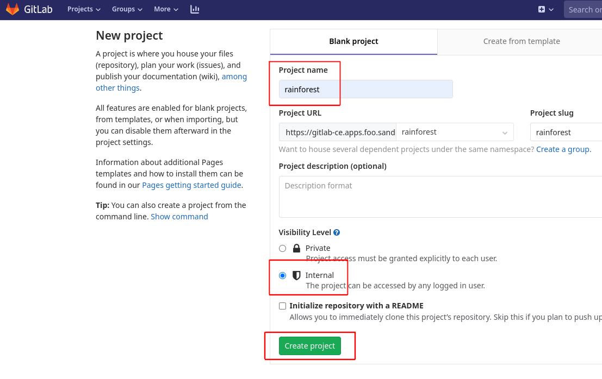
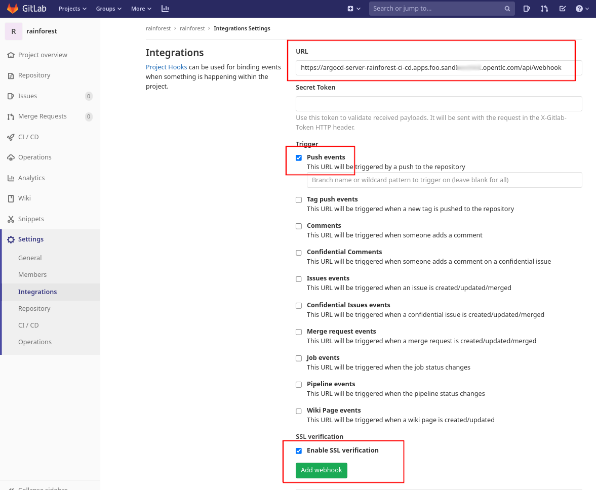

## 🐙 ArgoCD
## ArgoCD GitOps setup

ArgoCD is a gitops controller. We will use the OpenShift Gitops operator to deploy our team based ArgoCD which will deploy and configure all of our other application tools.

1. Check these environment variables are configured in your DevSpaces Terminal.

   ```bash
   echo $TEAM_NAME
   echo $GIT_SERVER
   ```

2. We need to use a ServiceAccount to connect ArgoCD to Vault which we will setup shortly. For now, we will just configure the ServiceAccount name to use.

   ```bash  
   export SERVICE_ACCOUNT=vault
   ```
   
3. Helm setup

   ```bash
   helm repo add redhat-cop https://redhat-cop.github.io/helm-charts
   ```

4. We configure the cluster scoped ArgoCD Operator so that we may create a privileged Team based ArgoCD instance. Ideally we want a less privileged instance that just controls our teams namespaces - but for now this will suffice. [Read more about aligning Teams and ArgoCD here.](https://github.com/redhat-cop/helm-charts/blob/master/charts/gitops-operator/TEAM_DOCS.md)

    ```bash
    run()
    {
      NS=$(oc get subscriptions.operators.coreos.com/openshift-gitops-operator -n openshift-operators \
        -o jsonpath='{.spec.config.env[?(@.name=="ARGOCD_CLUSTER_CONFIG_NAMESPACES")].value}')
      opp=
      if [ -z $NS ]; then
        NS="${TEAM_NAME}-ci-cd"
        opp=add
      elif [[ "$NS" =~ .*"${TEAM_NAME}-ci-cd".* ]]; then
        echo "${TEAM_NAME}-ci-cd already added."
        return
      else
        NS="${TEAM_NAME}-ci-cd,${NS}"
        opp=replace
      fi
      oc -n openshift-operators patch subscriptions.operators.coreos.com/openshift-gitops-operator --type=json \
        -p '[{"op":"'$opp'","path":"/spec/config/env/1","value":{"name": "ARGOCD_CLUSTER_CONFIG_NAMESPACES", "value":"'${NS}'"}}]'
      echo "EnvVar set to: $(oc get subscriptions.operators.coreos.com/openshift-gitops-operator -n openshift-operators \
        -o jsonpath='{.spec.config.env[?(@.name=="ARGOCD_CLUSTER_CONFIG_NAMESPACES")].value}')"
    }
    run
    ```

   

5. Setup our ArgoCD configuration. There is quite a bit of detail here. We configure the [ArgoCD Vault Plugin](https://github.com/argoproj-labs/argocd-vault-plugin) so that we can integrate our secrets management with ArgoCD.

   ```yaml
   cat << EOF > /tmp/argocd-values.yaml
   ignoreHelmHooks: true
   operator: []
   namespaces:
     - ${TEAM_NAME}-ci-cd
   argocd_cr:
     statusBadgeEnabled: true
     repo:
       mountsatoken: true
       serviceaccount: ${SERVICE_ACCOUNT}
       volumes:
       - name: custom-tools
         emptyDir: {}
       initContainers:
       - name: download-tools
         image: registry.access.redhat.com/ubi8/ubi-minimal:latest
         command: [sh, -c]
         env:
           - name: AVP_VERSION
             value: "1.13.1"
         args:
           - >-
             curl -Lo /tmp/argocd-vault-plugin https://github.com/argoproj-labs/argocd-vault-plugin/releases/download/v\${AVP_VERSION}/argocd-vault-plugin_\${AVP_VERSION}_linux_amd64 && chmod +x /tmp/argocd-vault-plugin && mv /tmp/argocd-vault-plugin /custom-tools/
         volumeMounts:
         - mountPath: /custom-tools
           name: custom-tools
       volumeMounts:
       - mountPath: /usr/local/bin/argocd-vault-plugin
         name: custom-tools        
         subPath: argocd-vault-plugin    
     initialRepositories: |
       - name: rainforest
         url: https://${GIT_SERVER}/${TEAM_NAME}/data-mesh-pattern.git
     repositoryCredentials: |
       - url: https://${GIT_SERVER}
         type: git
         passwordSecret:
           key: password
           name: git-auth
         usernameSecret:
           key: username
           name: git-auth
     configManagementPlugins: |
       - name: argocd-vault-plugin
         generate:
           command: ["sh", "-c"]
           args: ["argocd-vault-plugin -s ${TEAM_NAME}-ci-cd:team-avp-credentials generate ./"]
       - name: argocd-vault-plugin-helm
         init:
           command: [sh, -c]
           args: ["helm dependency build"]
         generate:
           command: ["bash", "-c"]
           args: ['helm template "\$ARGOCD_APP_NAME" -n "\$ARGOCD_APP_NAMESPACE" -f <(echo "\$ARGOCD_ENV_HELM_VALUES") . | argocd-vault-plugin generate -s ${TEAM_NAME}-ci-cd:team-avp-credentials -']
       - name: argocd-vault-plugin-kustomize
         generate:
           command: ["sh", "-c"]
           args: ["kustomize build . | argocd-vault-plugin -s ${TEAM_NAME}-ci-cd:team-avp-credentials generate -"]
   EOF
   ```

6. Install ArgoCD using our configuration.

   ```bash
   helm upgrade --install argocd \
     --namespace ${TEAM_NAME}-ci-cd \
     -f /tmp/argocd-values.yaml \
     --create-namespace \
     redhat-cop/gitops-operator
   ```

   You should see the pods spun up in the <TEAM_NAME>-ci-cd project.

   

7. Login to ArgoCD using the OpenShift button. Login as **admin**. On the first login you will be asked to approve OAuth permissions. 

    ```bash
    echo https://$(oc get route argocd-server --template='{{ .spec.host }}' -n ${TEAM_NAME}-ci-cd)
    ```

   

8. We will use ArgoCD Projects, set these up now. The **rainforest** project is for our shared middleware, whilst the **daintree** is for our per-team tools.

   ```bash
   oc apply -n ${TEAM_NAME}-ci-cd -k /projects/data-mesh-pattern/tenant-argocd/overlay/cluster-dev/rainforest
   ```

   You can see these in the ArgoCD UI **Settings > Projects**

   

9. Login to Gitlab using a data science **USER_NAME** and the LDAP identity provider. Create an Internal Group called **<TEAM_NAME>**.

    ```bash
    echo https://$(oc get route gitlab-ce --template='{{ .spec.host }}' -n gitlab)
    ```

    

10. Create an Internal Project called **data-mesh-pattern**.

    

11. We will use a **Personal Access Token** to check in the code as the data science user.

    ```bash
    export GITLAB_USER=${USER_NAME}
    ```
       
    ```bash
    export GITLAB_PASSWORD=${USER_PASSWORD}
    ```
    
    ```bash
    gitlab_pat
    ```
    
    ```bash
    cd /projects/data-mesh-pattern
    git remote set-url origin https://${GITLAB_USER}:${GITLAB_PAT}@${GIT_SERVER}/${TEAM_NAME}/data-mesh-pattern.git
    ```
    
12. Push our cloned code to Gitlab.
    
    ```bash
    cd /projects/data-mesh-pattern
    git add .
    git commit -am "🐙 ADD - data-mesh-pattern 🐙"
    git push -u origin --all
    ```

13. Let's create a GitLab webhook that triggers ArgoCD to immediately refresh when code is checked in. Browse to **Gitlab > Rainforest project > Settings > Integrations**. Add a webhook with using this url:

   ```bash
   echo https://$(oc -n <TEAM_NAME>-ci-cd get route argocd-server --template='{{ .spec.host}}'/api/webhook)
   ```

   

🪄🪄 Now, let's carry on and configure our Secrets ... !🪄🪄
