## 🔐 Secrets
## Vault and Application Secrets Setup

We are going to configure Hashicorp Vault as our application secret backend. A single vault pod instance was deployed as part of the **plaform-base** helm chart we installed earlier. We need to configure this for our team to use.

### Configure Vault

1. We configured ArgoCD with a service account name to use when connecting to Vault. Let's create the Service Account now.

   ```bash
   oc login --server=https://api.${CLUSTER_DOMAIN##apps.}:6443 -u ${USER_NAME} -p ${USER_PASSWORD}
   ```
   
   ```bash
   oc -n ${TEAM_NAME}-ci-cd create sa ${SERVICE_ACCOUNT}
   ```

2. In OpenShift 4.11+ Service Accounts are not configured with default token secrets. Let's create it.

   ```yaml
   cat <<EOF | oc -n ${TEAM_NAME}-ci-cd apply -f -
   apiVersion: v1
   kind: Secret
   metadata:
     name: vault-token
     annotations:
       kubernetes.io/service-account.name: "${SERVICE_ACCOUNT}" 
   type: kubernetes.io/service-account-token 
   EOF
   ```

3. Link secret vault-token to sa

   ```bash
   oc -n ${TEAM_NAME}-ci-cd secrets link ${SERVICE_ACCOUNT} vault-token
   ```

4. The Service Account mst be able to read secrets and be used for authentication in our <TEAM_NAME>-ci-cd namespace. Let's create the RBAC.

   ```bash
   oc adm policy add-cluster-role-to-user edit -z ${SERVICE_ACCOUNT} -n ${TEAM_NAME}-ci-cd
   oc adm policy add-cluster-role-to-user system:auth-delegator -z ${SERVICE_ACCOUNT} -n ${TEAM_NAME}-ci-cd
   ```

5. To bootstrap ArgoCD, we will manually create a secret for ArgoCD to connect to GitLab, later on we will add this via GitOps and Vault instead.

   ```yaml
   cat <<EOF | oc -n ${TEAM_NAME}-ci-cd apply -f -
   apiVersion: v1
   data:
     password: "$(echo -n ${GITLAB_PAT} | base64)"
     username: "$(echo -n ${GITLAB_USER} | base64)"
   kind: Secret
   metadata:
     annotations:
       tekton.dev/git-0: https://${GIT_SERVER}
     name: git-auth
   type: kubernetes.io/basic-auth
   EOF
   ```

   Refresh the list in **Argocd > Settings > Respoitories** and we should see our credentials and GitLab repo OK.

   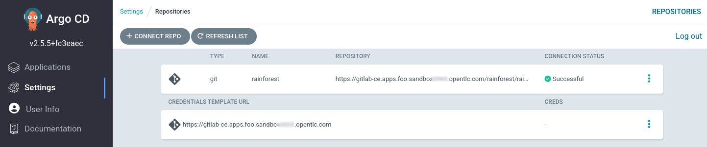

6. We need to unseal Hashi Vault to be able to start using it. Initialize the vault - we only do this once.

   ```bash
   oc -n rainforest exec -ti platform-base-vault-0 -- vault operator init -key-threshold=1 -key-shares=1
   ```

   You should see the following sort of debug, **copy these somewhere safe**!

   ```bash
   Unseal Key 1: <unseal key>
   Initial Root Token: <root token>
   ```
   
   Export them in the terminal for now as well.

   ```bash
   export UNSEAL_KEY=<unseal key>
   ```
   
   ```bash
   export ROOT_TOKEN=<root token>
   ```

7. Unseal the vault.   

   ```bash
   oc -n rainforest exec -ti platform-base-vault-0 -- vault operator unseal $UNSEAL_KEY
   ```

   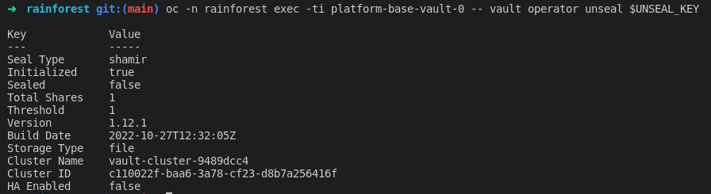

<p class="tip">
  ⛷️ <b>TIP</b> ⛷️ - If the vault pod is restarted when your cluster is restarted, you will need to run the unseal command. This can easily be run from a k8s cronjob.
</p>

8. Login to Hashi Vault UI using the ROOT_TOKEN. This is useful for debugging and visually understanding Vault. It uses a self signed certificate, so accepts TLS warnings in the browser.

    ```bash
    echo https://$(oc get route platform-base-vault --template='{{ .spec.host }}' -n rainforest)
    ```

   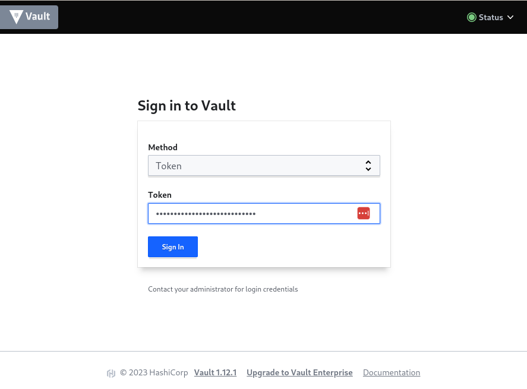

9. We will integrate Vault with our IPA/ldap authentication that we set up as part of the cluster installation post-install steps.

   ```bash
   export VAULT_ROUTE=vault.${CLUSTER_DOMAIN}
   export VAULT_ADDR=https://${VAULT_ROUTE}
   export VAULT_SKIP_VERIFY=true
   ```

10. Login to Vault fom the command line using the root token.

   ```bash
   vault login token=${ROOT_TOKEN}
   ```

   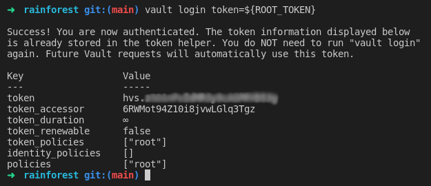

11. Enable LDAP auth method in vault
 
   ```bash
   vault auth enable ldap
   ```

12. Create auth config using our ldap admin account credentials.
 
   ```bash
   vault write auth/ldap/config \
     url="ldap://ipa.ipa.svc.cluster.local:389" \
     binddn="uid=ldap_admin,cn=users,cn=accounts,dc=redhatlabs,dc=dev" \
     bindpass="${LDAP_ADMIN_PASSWORD}" \
     userdn="cn=users,cn=accounts,dc=redhatlabs,dc=dev" \
     userattr="uid" \
     groupdn="cn=student,cn=groups,cn=accounts,dc=redhatlabs,dc=dev" \
     groupattr="cn"
   ```

   In the Vault UI you should see the **ldap/** entry under **Access > Auth Methods**.

   

13. Create Vault application policy for our <TEAM_NAME>-ci-cd and **student** user group. We allow CRUD access to secrets for user's in the student group.
 
    ```bash
    export APP_NAME=vault
    export TEAM_GROUP=student
    export PROJECT_NAME=<TEAM_NAME>-ci-cd
    ```

    ```bash
    vault policy write $TEAM_GROUP-$PROJECT_NAME -<<EOF
    path "kv/data/{{identity.groups.names.$TEAM_GROUP.name}}/$PROJECT_NAME/*" {
        capabilities = [ "create", "update", "read", "delete", "list" ]
    }
    path "auth/$CLUSTER_DOMAIN-$PROJECT_NAME/*" {
        capabilities = [ "create", "update", "read", "delete", "list" ]
    }
    EOF
    ```

    In the Vault UI you should see this created under **Policies > ACL Policies**.
    
    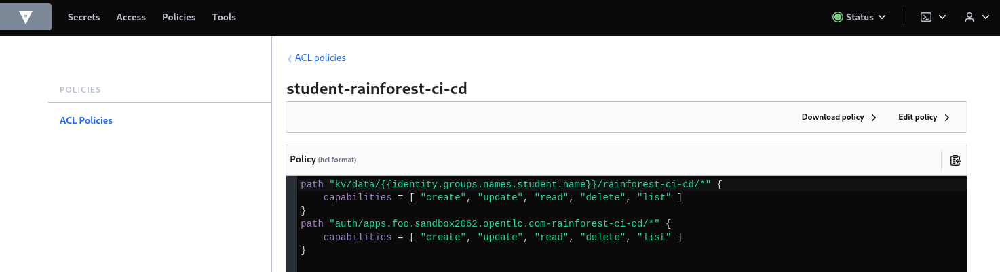

14. Test that ldap login works for **USER_NAME**. Use your **USER_PASSWORD** when prompted.

    ```bash
    vault login -method=ldap username=${USER_NAME}
    ```

15. We want to bind the user entity id mapping to our ACL. Log back in with the root token and grab the user's entity id.
   
    ```bash
    vault login token=${ROOT_TOKEN}
    ```
   
    ```bash
    export ENTITY_ID=$(vault list -format json identity/entity/id | jq -r '.[]')
    ```

    ```bash
    vault write identity/group name="$TEAM_GROUP" \
    policies="$TEAM_GROUP-$PROJECT_NAME" \
    member_entity_ids=$ENTITY_ID \
    metadata=team="$TEAM_GROUP"
    ```

    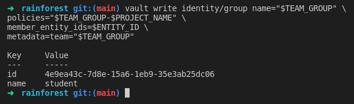

16. ArgoCD will connect with a different Vault authentication mechanism. Enable Kubernetes auth in vault.

   ```bash
   vault auth enable -path=$CLUSTER_DOMAIN-${PROJECT_NAME} kubernetes
   ```
   
17. We need the Vault mount accessor name to create our ACL Policy for Kubernetes auth.
 
   ```bash
   export MOUNT_ACCESSOR=$(vault auth list -format=json | jq -r ".\"$CLUSTER_DOMAIN-$PROJECT_NAME/\".accessor")
   ```

   Create the Policy. Note that we only **read and list** secrets from ArgoCD, not write or update.
   
   ```bash
   vault policy write $CLUSTER_DOMAIN-$PROJECT_NAME-kv-read -<< EOF
   path "kv/data/$TEAM_GROUP/{{identity.entity.aliases.$MOUNT_ACCESSOR.metadata.service_account_namespace}}/*" {
   capabilities=["read","list"]
   }
   EOF
   ```

   In the Vault UI you should see this created under **Policies > ACL Policies**.

   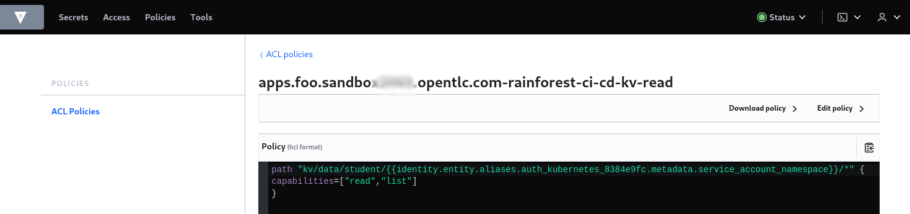

18. We store our application secrets as **kv2** format. Enable kv2 in vault.
 
   ```bash
   vault secrets enable -path=kv/ -version=2 kv
   ```

19. The rest of the steps can now be carried out by our data science user in a self-service manner. Log back in as our **USER_NAME** to provision the ArgoCD Service Account token for k8s auth in vault.

   ```bash
   vault login -method=ldap username=${USER_NAME}
   ```

   We should see our user now has the correct policies set as well.

   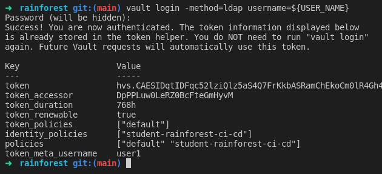

   Bind our k8s auth to the read ACL policy we created earlier.

   ```bash
   vault write auth/$CLUSTER_DOMAIN-$PROJECT_NAME/role/$APP_NAME \
   bound_service_account_names=$APP_NAME \
   bound_service_account_namespaces=$PROJECT_NAME \
   policies=$CLUSTER_DOMAIN-$PROJECT_NAME-kv-read \
   period=120s
   ```

   We will use the long lived Service Account token secret 

   ```bash
   export SA_TOKEN=$(oc -n ${PROJECT_NAME} get sa/${SERVICE_ACCOUNT} -o yaml | grep ${APP_NAME}-token | awk '{print $3}')
   export SA_JWT_TOKEN=$(oc -n ${PROJECT_NAME} get secret $SA_TOKEN -o jsonpath="{.data.token}" | base64 --decode; echo)
   export SA_CA_CRT=$(oc -n ${PROJECT_NAME} get secret $SA_TOKEN -o jsonpath="{.data['ca\.crt']}" | base64 --decode; echo)
   ```

   Check that $SA_JWT_TOKEN is set OK. Now write this into our k8s auth config.

   ```bash
   vault write auth/$CLUSTER_DOMAIN-${PROJECT_NAME}/config \
   token_reviewer_jwt="$SA_JWT_TOKEN" \
   kubernetes_host="$(oc whoami --show-server)" \
   kubernetes_ca_cert="$SA_CA_CRT"
   ```

20. Create the team ArgoCD Vault Plugin Secret that is used to find the correct path to the k8s auth we just created. 

   ```bash
   export AVP_TYPE=vault
   export VAULT_ADDR=https://platform-base-vault.rainforest.svc:8200   # vault url
   export AVP_AUTH_TYPE=k8s                                            # kubernetes auth
   export AVP_K8S_ROLE=vault                                           # vault role/sa
   export VAULT_SKIP_VERIFY=true
   export AVP_MOUNT_PATH=auth/$CLUSTER_DOMAIN-$PROJECT_NAME
   ```

   ```yaml
   cat <<EOF | oc apply -n ${PROJECT_NAME} -f-
   apiVersion: v1
   stringData:
     VAULT_ADDR: "${VAULT_ADDR}"
     VAULT_SKIP_VERIFY: "${VAULT_SKIP_VERIFY}"
     AVP_AUTH_TYPE: "${AVP_AUTH_TYPE}"
     AVP_K8S_ROLE: "${AVP_K8S_ROLE}"
     AVP_TYPE: "${AVP_TYPE}"
     AVP_K8S_MOUNT_PATH: "${AVP_MOUNT_PATH}"
   kind: Secret
   metadata:
     name: team-avp-credentials
     namespace: ${PROJECT_NAME}
   type: Opaque
   EOF
   ```

21. Create an example kv2 secret to test things out.

   ```bash
   export VAULT_HELM_RELEASE=vault
   export VAULT_ROUTE=${VAULT_HELM_RELEASE}.$CLUSTER_DOMAIN
   export VAULT_ADDR=https://${VAULT_ROUTE}
   export VAULT_SKIP_VERIFY=true
   ```
   
   ```bash
   export APP_NAME=secret-test
   export TEAM_GROUP=student
   export PROJECT_NAME=<TEAM_NAME>-ci-cd
   ```
   
   ```bash
   vault login -method=ldap username=${USER_NAME}
   ```
   
   ```bash
   vault kv put kv/$TEAM_GROUP/$PROJECT_NAME/$APP_NAME \
   app=$APP_NAME \
   username=foo \
   password=bar 
   ```
   
   ```bash
   vault kv get kv/$TEAM_GROUP/$PROJECT_NAME/$APP_NAME
   ```

   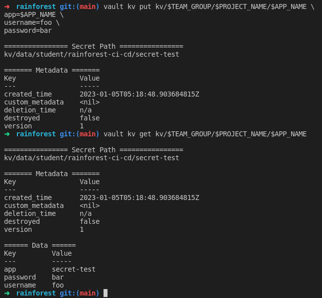

   In the Vault UI you should see this created under **Secrets > kv/ > student/rainforest-ci-cd/secret-test**

   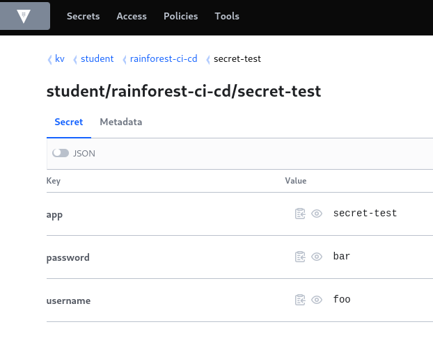

### Create Application Secrets

We have an encrypted file with all of the vault commands pre-baked to create our application secrets. We need to make some quick changes before running the script.

1. Using **ansible-vault** un-encrypt the Rainforest **vault-secrets** file. The decryption key will be provided by your instructor.

   ```bash
   ansible-vault decrypt /projects/rainforest/gitops/secrets/vault-rainforest
   ```

2. In your IDE, Globally replace these two matches across ALL files in the Rainforest code base. This will modify some ~70 files in one go.

   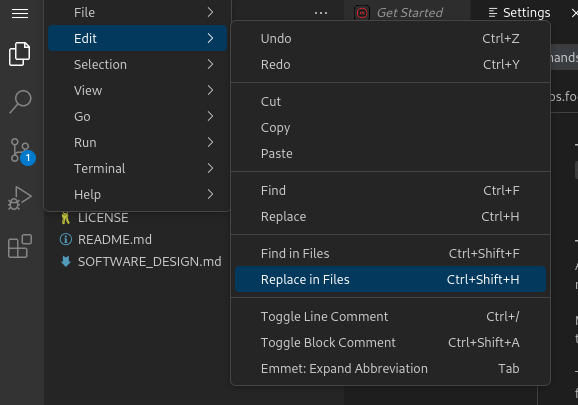

   Use **Replace All** for the cluster domain in the code with **our actual** cluster domain.

   ```bash
   foo.sandbox1234.opentlc.com ->  echo ${CLUSTER_DOMAIN##apps.}
   ```

   Use **Replace All** for the Github coordinates with our Gitlab ones. 

   ```bash
   github.com/opendatahub-io-contrib ->  <GIT_SERVER>/<TEAM_NAME>
   ```

   💥 DO NOT CHECK IN the files just yet !! 💥

3. Since we have a new cluster, we need to update the Trino trustore secret with our own cluster CA certs.

   ```bash
   openssl s_client -showcerts -connect ipa.ipa.svc.cluster.local:636 </dev/null 2>/dev/null | awk '/BEGIN CERTIFICATE/,/END CERTIFICATE/ {print $0}' > /tmp/ipa.pem
   ```
   
   ```bash
   openssl s_client -showcerts -connect api.${CLUSTER_DOMAIN##apps.}:6443 </dev/null 2>/dev/null | awk '/BEGIN CERTIFICATE/,/END CERTIFICATE/ {print $0}' > /tmp/oc.pem
   ```

   ```bash
   cd /projects/rainforest/supply-chain/trino/trino-certs
   keytool -import -alias ca -file /projects/rainforest/supply-chain/trino/trino-certs/ca.crt -keystore truststore.jks -storepass password -trustcacerts -noprompt
   ```

   ```bash 
   keytool -import -alias oc -file /tmp/oc.pem -keystore truststore.jks -storepass password -trustcacerts -noprompt
   ```

   ```bash
   keytool -import -alias ipa -file /tmp/ipa.pem -keystore truststore.jks -storepass password -trustcacerts -noprompt
   ```

   ```bash
   oc -n <TEAM_NAME>-ci-cd create secret generic truststore --from-file=truststore.jks
   ```
   
   Manually update the truststore.jks value variable - TRUSTSTORE="" in the #trino-truststore section of **vault-rainforest** secrets file.

   ```bash
   oc -n <TEAM_NAME>-ci-cd get secret truststore -o=jsonpath='{.data}'
   ```

   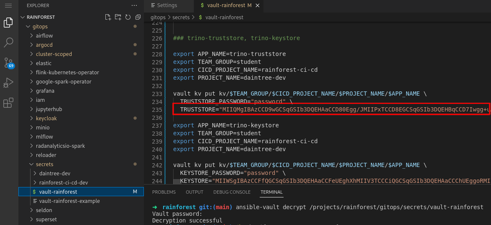

   Remove the temporary secret

   ```bash
   oc -n <TEAM_NAME>-ci-cd delete secret truststore
   ```

4. If your <TEAM_NAME> is *not* *rainforest*, **Replace All** across files:

   ```bash
   rainforest-ci-cd ->  <TEAM_NAME>-ci-cd
   ```

5. Create all the application secrets in vault. Run this script.

   ```bash
   sh /projects/rainforest/gitops/secrets/vault-rainforest
   ```

   You should see vault secrets being created.

   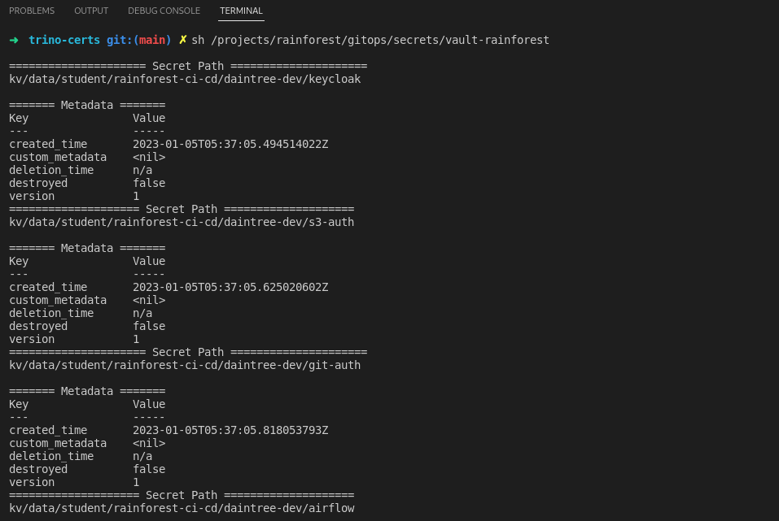

   You can also browse to these in the Vault UI.

6. Encrypt rainforest vault-secrets file and check all our changes into git.

   ```bash
   ansible-vault encrypt /projects/rainforest/gitops/secrets/vault-rainforest
   ```

   ```bash#test
   cd /projects/rainforest
   git add .
   git commit -am "🐙 ADD - cluster rename and vault secrets file 🐙"
   git push -u origin --all
   ```

🪄🪄 Now, let's carry on and Build and Deploy our Application images ... !🪄🪄
