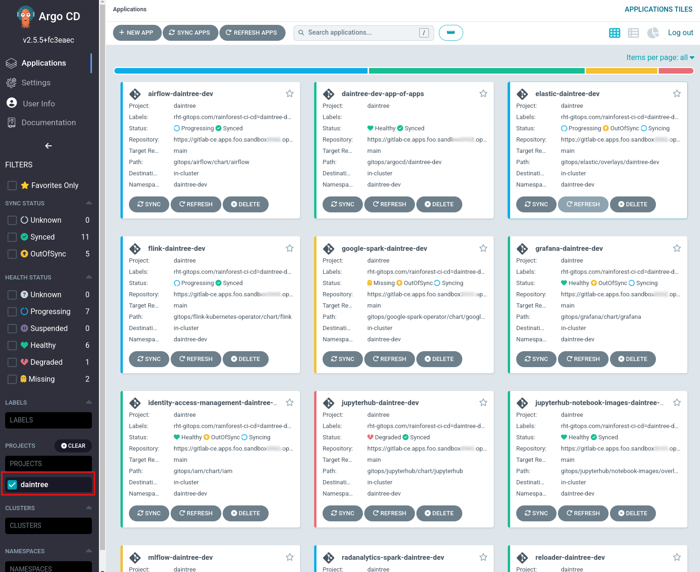

## 🎸 Deploy Apps
## Deploy AIML apps

With all the images built, we can now create our team applications. In the Lab we only have one data science user and a single namespace **daintree-dev**. The patterns in use can be scaled to deploy to many clusters and many namespaces to support multiple teams using different application compositions. The **rainforest/gitops/daintree-dev** folder holds the team apps that make up our AIML platform for the demo's we can run in the next section. 

1. Login to the DevSpace Terminal and create our ArgoCD app of apps for **daintree-dev**

   ```bash
   cd /projects/data-mesh-pattern
   oc -n <TEAM_NAME>-ci-cd apply -f gitops/argocd/cluster-dev/daintree-dev-app-of-apps.yaml
   ```

   In ArgoCD we can filter by **Project** for daintree apps. After several minutes they should all **Sync**. It is expected that **airflow** and **google-spark** will remain in the **Progressing** or **Degraded** Status until we configure S3 Buckets in the next step.

   

   **airflow** will remain unhealthy until we configure a separate git repository for the dags in Exercise 4.1
