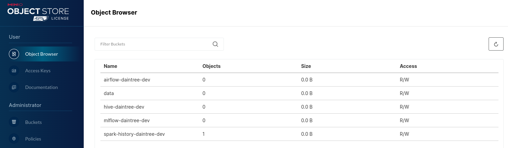

## 🪣 S3 buckets
## Configure s3 buckets

Ideally we could automate this S3 configuration. But we keep this separate for now, in case we start using another s3 provider instead of minio.

1. Configure s3 buckets for our apps. Login to DevSpaces Terminal.

   ```bash
   export PROJECT_NAME=daintree-dev
   ```

   Get the S3 creds from the secret.
   
   ```bash
   AWS_ACCESS_KEY_ID=$(oc get secret s3-auth -n ${PROJECT_NAME} -o jsonpath='{.data.AWS_ACCESS_KEY_ID}' | base64 -d)
   ```
   
   ```bash
   AWS_SECRET_ACCESS_KEY=$(oc get secret s3-auth -n ${PROJECT_NAME} -o jsonpath='{.data.AWS_SECRET_ACCESS_KEY}' | base64 -d)
   ```

   Use the **minio client** to create an alias called **dev** which points to minio.
   
   ```bash
   mc alias set dev http://minio.<TEAM_NAME>-ci-cd.svc.cluster.local:9000 ${AWS_ACCESS_KEY_ID} ${AWS_SECRET_ACCESS_KEY} 
   ```

   Create our Buckets.
   
   ```bash
   mc mb dev/airflow-${PROJECT_NAME}
   mc mb dev/hive-${PROJECT_NAME}
   mc mb dev/hive-iceberg-${PROJECT_NAME}
   mc mb dev/pachyderm
   mc mb dev/iceberg
   mc mb dev/data
   ```
 
2. Login to minio web ui using the S3 credentials from above.

   ```bash
   echo https://$(oc get route minio --template='{{ .spec.host }}' -n ${TEAM_NAME}-ci-cd)
   ```

   You can see the buckets we just created.

   

   If you check back in ArgoCD, all apps should now be **Healthy**.
