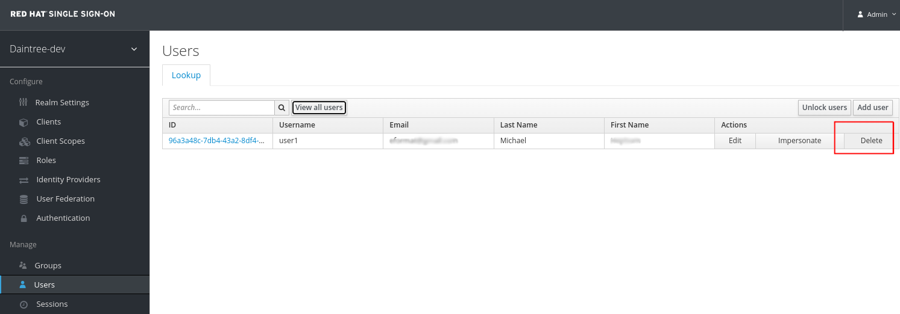
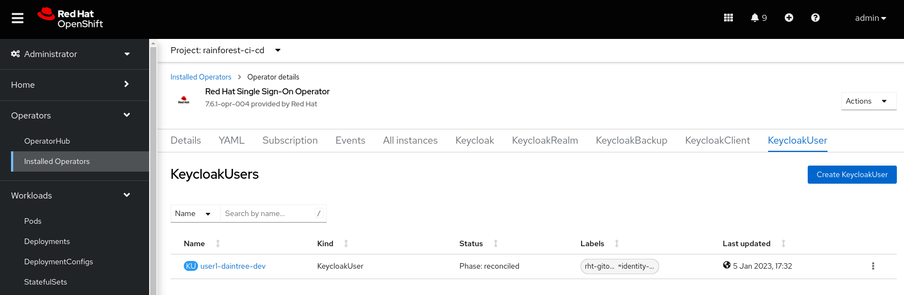
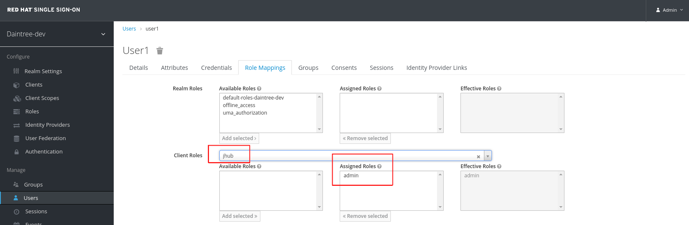

## 👔 Single Sign On
## Configure SSO

We are using a GitOps pattern to manage single sign on for all of our apps. We create **Keycloak Users** and **Roles** using a helm chart. The **values.yaml** file contains a list of users and role mappings for each team.

1. Open and update the **rainforest/gitops/iam/daintree-dev/values.yaml** file with UID and your **USER_NAME**.

   ```bash
   oc get user ${USER_NAME} -o jsonpath='{.metadata.uid}'
   ```
   
   ```yaml
   users:
     user1:
       username: "user1"
       firstName: "Joe"      <------- UPDATE NAME
       lastName: "Blogs"     <------- UPDATE NAME
       email: "user1@redhatlabs.dev"
       federatedIdentities:
         create: True
         userId: "<uid>"     <------- UPDATE UID
       clientRole: adminRole
       clusterRole: edit
   ```

   Check this file in.

   ```bash
   cd /projects/data-mesh-pattern
   git add gitops/iam/chart/iam/daintree-dev/values.yaml
   git commit -am "🐙 UPDATE - iam values file 🐙"
   git push
   ```

2. Login to SSO **Admininstration Console** as the **admin** user.

   ```bash
   echo -e https://$(oc get route keycloak --template='{{ .spec.host }}' -n ${TEAM_NAME}-ci-cd)
   ```

   ```bash
   echo -e $(oc get secret credential-keycloak -n ${TEAM_NAME}-ci-cd -o jsonpath='{.data.ADMIN_PASSWORD}' | base64 -d)
   ```

3. Browse to the **Daintree-dev** Realm **Manage Users** and **Delete** **USER_NAME**.

   

4. ArgoCD and the SSO Operator - will resync the user created from the helm chart.

   

   Now browse to Check Role mappings for <USER NAME>

   
 
