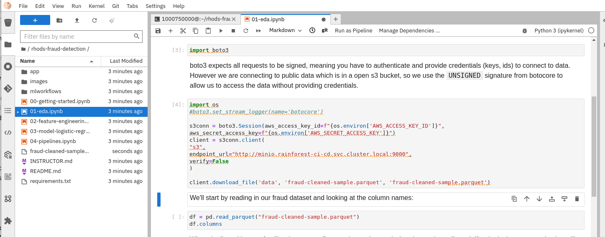
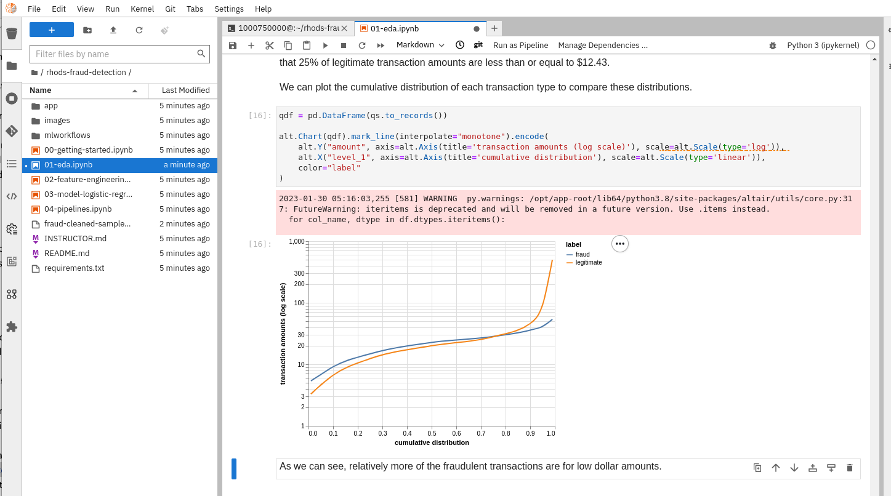
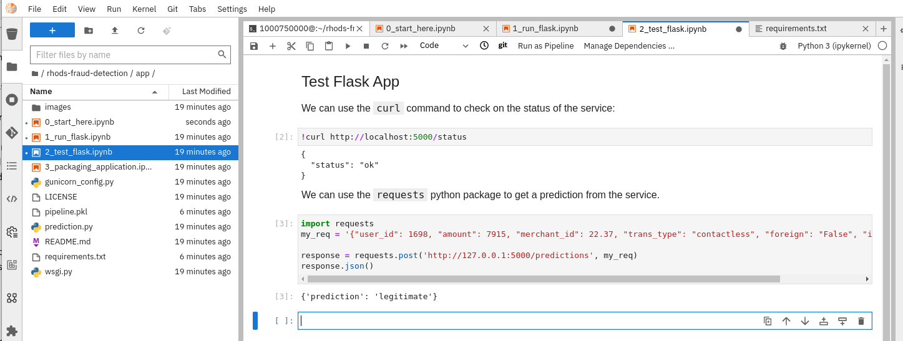

## 𝌭️ Fraud Detection
## Create a model to recognize fraud detection 
> learn howto to recognize fraud detection from a synthetic dataset

1. We can use the instructions here in our environment - https://github.com/OpenShiftDemos/rhods-fraud-detection

   ```bash
   cd /opt/app-root/src
   git clone https://github.com/OpenShiftDemos/rhods-fraud-detection.git 
   ```

2. Use the **Elyra TensorFlow Notebook Image**
3. There are some minor changes required when running the first notebook - **01-eda.ipynb**. 30 million synthetic transactions were generated using these notebooks - https://github.com/OpenShiftDemos/fraud-notebooks in parquet format. We need to upload this file into our s3.

   Download data

   ```bash
   wget https://github.com/eformat/fraud-notebooks/releases/download/0.0.1/fraud-cleaned-sample.parquet
   ```

   Copy to s3

   ```bash
   mc cp fraud-cleaned-sample.parquet dev/data
   ```

4. We have all the notebook imports for **01-eda.ipynb** in the base image, apart from these, add them:

   ```bash
   pip install pyarrow fastparquet
   ```

5. For completeness, use boto3 client in the notebook even though we already have the data!

   ```python
   import os
   #boto3.set_stream_logger(name='botocore')
   
   s3conn = boto3.Session(aws_access_key_id=f"{os.environ['AWS_ACCESS_KEY_ID']}",
   aws_secret_access_key=f"{os.environ['AWS_SECRET_ACCESS_KEY']}")
   client = s3conn.client(
   "s3",
   endpoint_url="http://minio.rainforest-ci-cd.svc.cluster.local:9000",
   verify=False
   )
   
   client.download_file('data', 'fraud-cleaned-sample.parquet', 'fraud-cleaned-sample.parquet')
   ```

   

6. When examining the data in **01-eda.ipynb**, the **Transaction amount distribution** section, update the graph so that it works:

   ```bash
   -alt.X("level_0", axis=alt.Axis(title='cumulative distribution'), scale=alt.Scale(type='linear')),
   +alt.X("level_1", axis=alt.Axis(title='cumulative distribution'), scale=alt.Scale(type='linear')), 
   ```

   

7. The other top level Notebooks should execute OK without modification - **02-feature-engineering.ipynb**, **03-model-logistic-regression.ipynb** and **04-pipelines.ipynb**

8. Next, when you get to the app part using Flask in **app/0_start_here.ipynb**, install these deps only, edit requirements.txt to contain:

   ```bash
   $ cat requirements.txt 
   Flask
   gunicorn
   pyarrow
   ```
   
   And Copy the Pipeline Pickelized model we generated into the **rhods-fraud-detection/app** folder (there is a much older version already checked into the repo which we don't want to use.)

   ```bash
   cp pipeline.pkl app/
   ```

   You should have no version warning when importing the **pipeline.pkl** model.

   

9. The Flask app test in **app/2_test_flask.ipynb** should run OK.

   
