## 𝌭️ Spark Pipeline
## Basic Apache Spark pipeline
> spark two ways (developer cluster, google spark operator), airflow pipeline promotion, spark history server

1. Brose to **File > Hub Control Panel** and re(start) the **Elyra Notebook Image with Spark**, Select **Default** container size. Use the same Env.Vars from ML Exercise.

   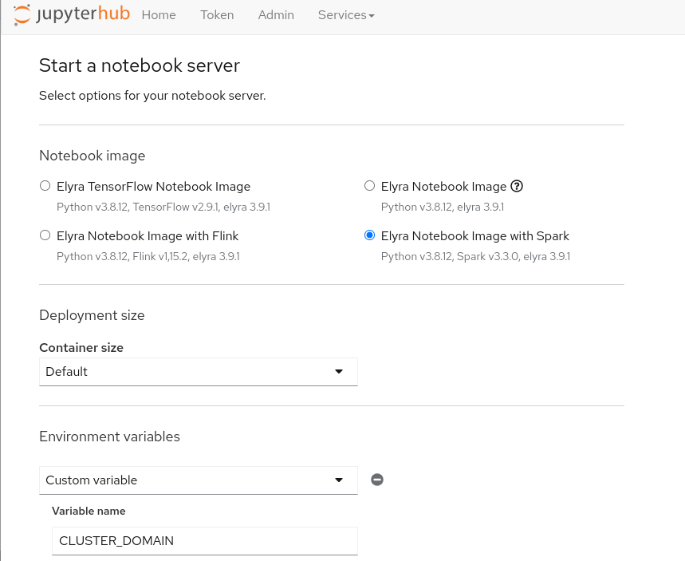

2. Once your notebook has opened, open **aimlops-demos/spark-pipeline** and Click on the notebook **hello-spark.ipynb**

   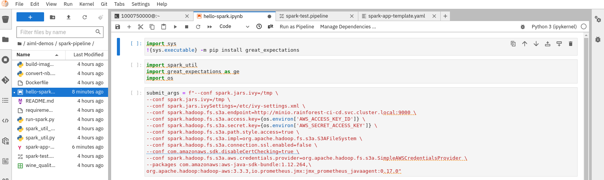

3. By starting the **Elyra Notebook Image with Spark** a small spark cluster will also be created for you to use. 

   ```bash
   oc login --server=https://api.${CLUSTER_DOMAIN##apps.}:6443 -u ${USER_NAME} -p ${PASSWORD}
   ```

   ```bash
   echo -e https://$(oc get route spark-cluster-${USER_NAME} --template='{{ .spec.host }}' -n ${PROJECT_NAME})
   ```

   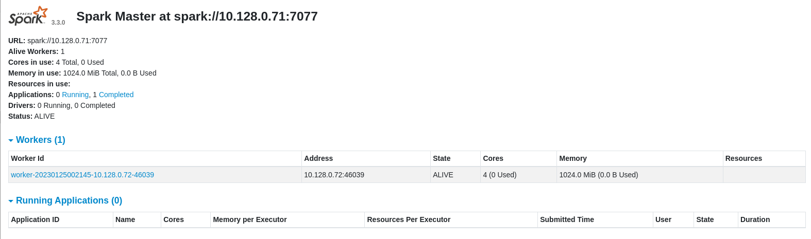

4. Install dependencies in the jhub terminal.

   ```bash
   pip install great_expectations
   ```

5. Follow the notebook. Once you have created your spark session, you should be able to see it in your spark master ui.

   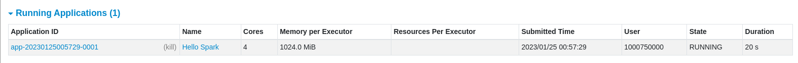

6. Upload _wine_quality.csv_ to s3 using mc client in the jhub terminal.

   ```bash
   mc cp /opt/app-root/src/aiml-demos/spark-pipeline/wine_quality.csv dev/data
   ```

7. Read the CSV file back into a dataframe using spark.
8. Use [great expectations](https://greatexpectations.io/) to check the data quality.
9. Open **spark-test.pipeline** browse Properties

   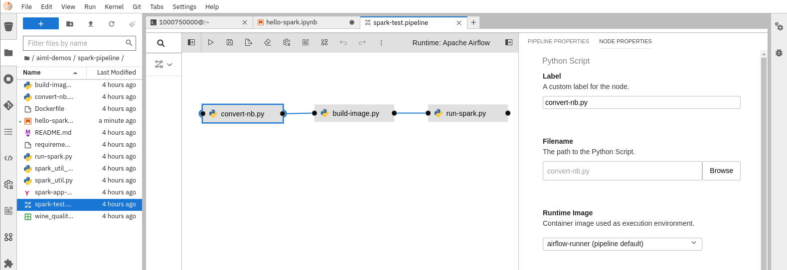

10. Open **spark-app-template** and edit jar deps to point to our nexus. **Save** the file once edited.

     ```yaml
      deps:
        jars:
          - >-
            https://nexus-rainforest-ci-cd.<CLUSTER_DOMAIN>/repository/maven-public/com/amazonaws/aws-java-sdk-bundle/1.11.1026/aws-java-sdk-bundle-1.11.1026.jar
          - >-
            https://nexus-rainforest-ci-cd.<CLUSTER_DOMAIN>/repository/maven-public/org/apache/hadoop/hadoop-aws/3.3.2/hadoop-aws-3.3.2.jar
     ```

11. Trigger Airflow Pipeline by selecting the triangle **Run** button and **OK**. The airflow runtime we created earlier will automatically be selected.

   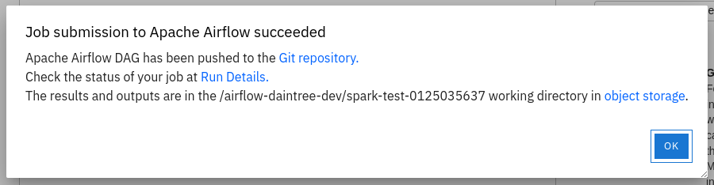

12. Watch build steps in Airflow

    ```bash
    echo -e https://$(oc get route airflow --template='{{ .spec.host }}' -n ${PROJECT_NAME})
    ```

   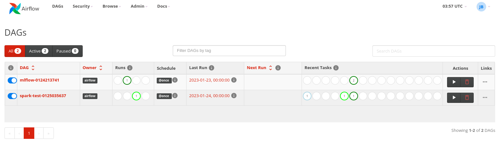

13. Check dag in git, logs in Airflow, and S3 logs

   spark test Dag is in git.

   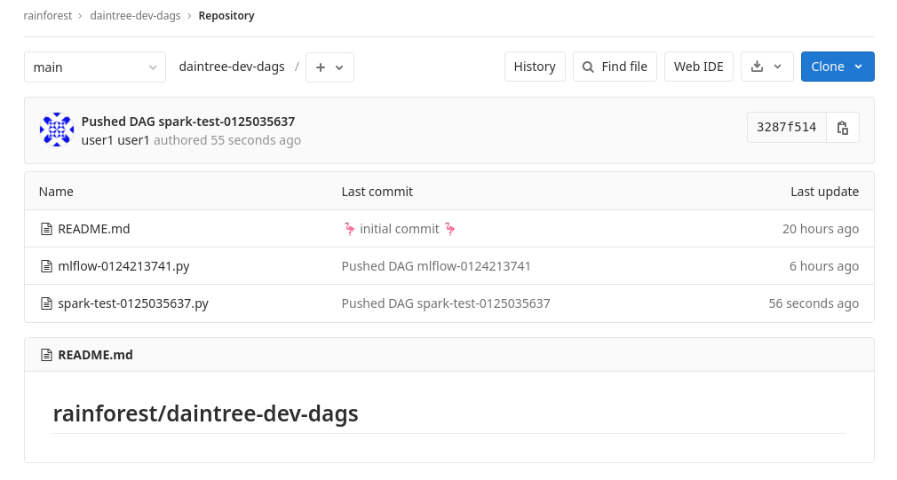

   Create **mc** alias **dev** if not already done in mlflow exercise.

   ```bash
   AWS_ACCESS_KEY_ID=$(oc get secret s3-auth -n ${PROJECT_NAME} -o jsonpath='{.data.AWS_ACCESS_KEY_ID}' | base64 -d)
   AWS_SECRET_ACCESS_KEY=$(oc get secret s3-auth -n ${PROJECT_NAME} -o jsonpath='{.data.AWS_SECRET_ACCESS_KEY}' | base64 -d)
   ```

   ```bash
   mc alias set dev http://minio.${TEAM_NAME}-ci-cd.svc.cluster.local:9000 ${AWS_ACCESS_KEY_ID} ${AWS_SECRET_ACCESS_KEY} 
   ```

   ```bash
   mc ls dev
   ```

15. Once the spark runner image has been built, the Google Spark pod will run our notebook.

   ```bash
   oc -n ${PROJECT_NAME} logs spark-test-driver -f
   ```

   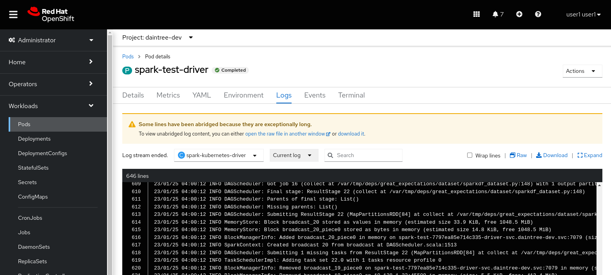

16. Once Google Spark job has run, we can check the Spark History server for details

   ```bash
   echo -e https://$(oc -n ${PROJECT_NAME} get route spark-history-server --template='{{ .spec.host }}')
   ```

   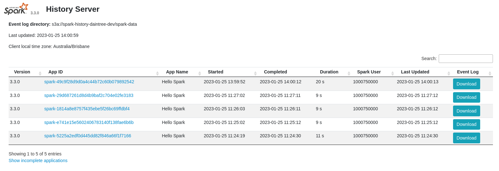

   Drill down into the job to see spark steps that ran.

   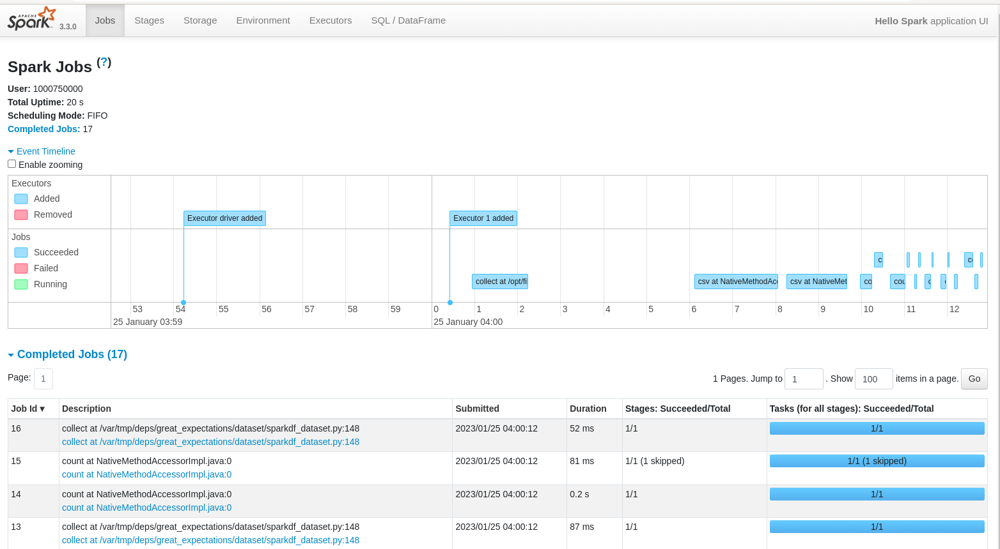
