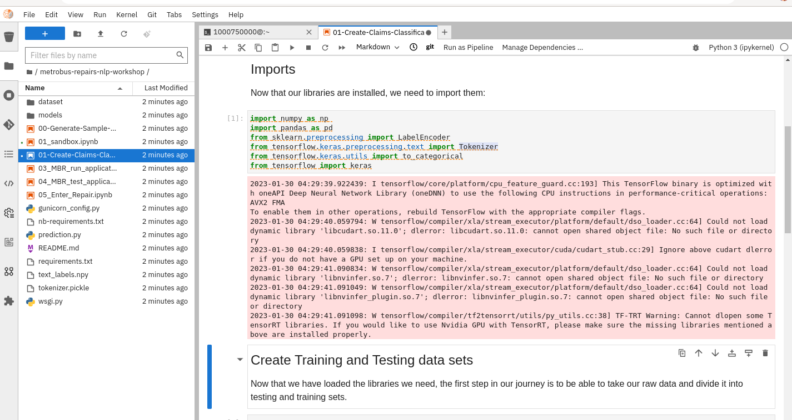
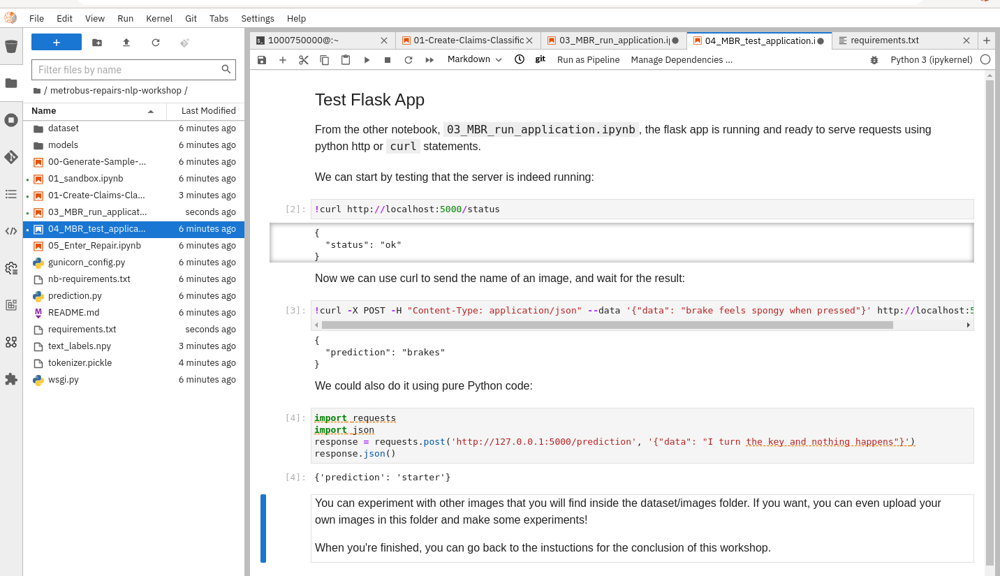

## 𝌭️ NLP
## Mastering Natural Language Processing
> learn howto categorize bus repair issues

1. We can use the instructions here in our environment - https://developers.redhat.com/developer-sandbox/activities/use-rhods-to-master-nlp

   ```bash
   cd /opt/app-root/src
   git clone https://github.com/rh-aiservices-bu/metrobus-repairs-nlp-workshop.git 
   ```

2. Use the **Elyra TensorFlow Notebook Image** this has all of the dependencies in nb-requirements.txt so you do not need to pip install them as part of **01-Create-Claims-Classification.ipynb**

   

3. When you want to test using Flask in **03_MBR_run_application.ipynb**, install these deps only, edit requirements.txt to contain:

   ```bash
   $ cat requirements.txt 
   Flask==2.0.3
   gunicorn==20.1.0
   ```

4. The Flask app test in **04_MBR_test_application.ipynb** should run OK.

   
