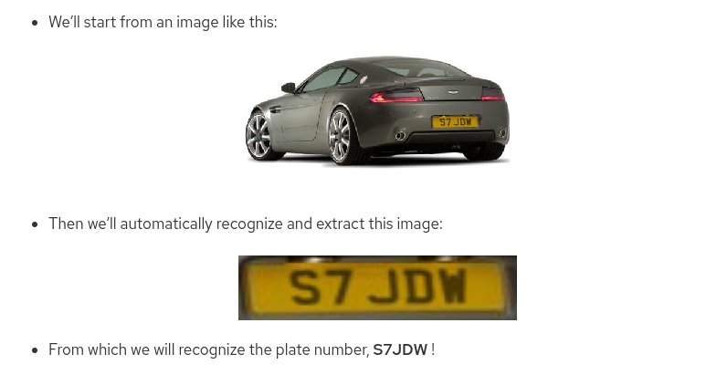
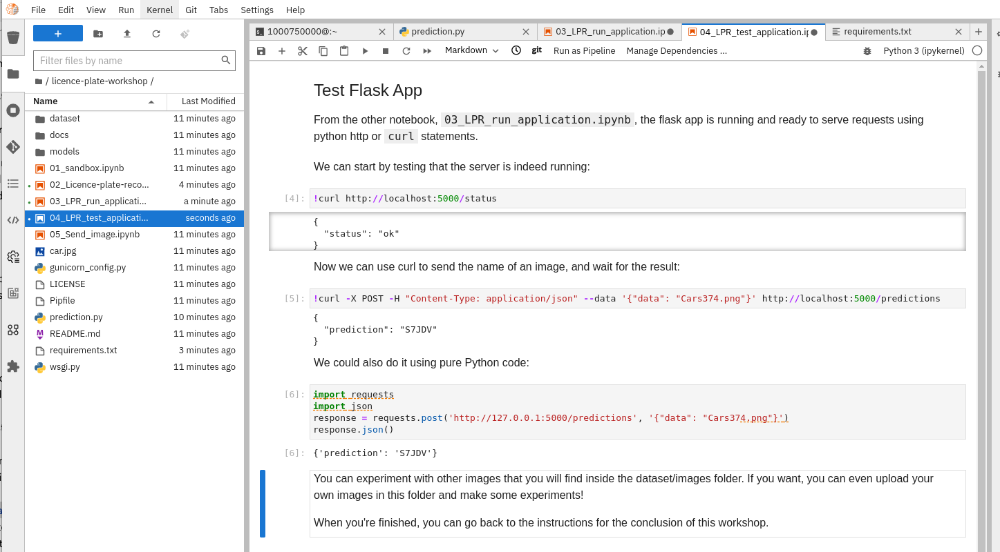

## 𝌭️ Licence Plate Recognition
## Use a model to recognize vehicle license plates 
> learn howto recognize licence plates in car pictures, and extract the number from its license plate.

1. We can use the instructions here in our environment - https://redhat-scholars.github.io/rhods-lp-workshop/rhods-lp-workshop/index.html

   ```bash
   cd /opt/app-root/src
   git clone https://github.com/rh-aiservices-bu/licence-plate-workshop.git 
   ```

   

2. Use the **Elyra TensorFlow Notebook Image**

3. When you want to run **02_Licence-plate-recognition.ipynb**, install these deps only in the first cell

   ```bash
   import sys
   !{sys.executable} -m pip install opencv-python-headless==4.5.*
   ```

4. Edit these two files **prediction.py** and **02_Licence-plate-recognition.ipynb** replace the old keras preprocessing import with the newer utils import:

   ```python
   -from keras.preprocessing.image import load_img, img_to_array
   +from tensorflow.keras.utils import load_img, img_to_array
   ```

   The noebook should run OK.

   

5. When you want to test using Flask in **03_LPR_run_application.ipynb**, install these deps only, edit requirements.txt to contain:

   ```bash
   $ cat requirements.txt 
   Flask==2.0.3
   gunicorn==20.1.0
   ```

6. The Flask app test in **04_LPR_test_application.ipynb** should run OK.

   
